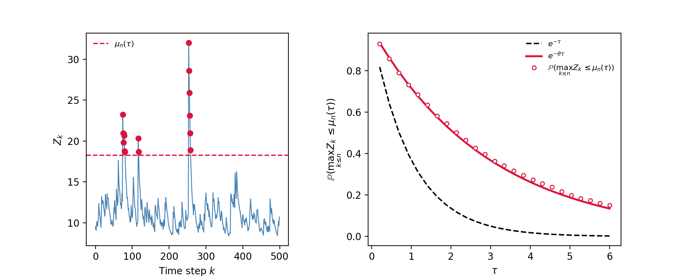
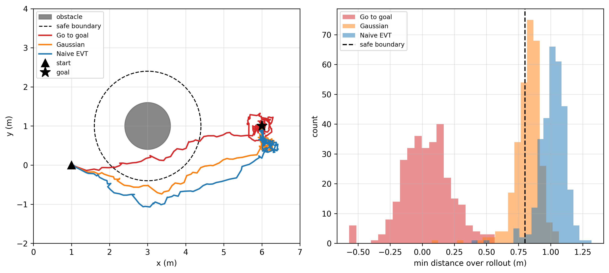
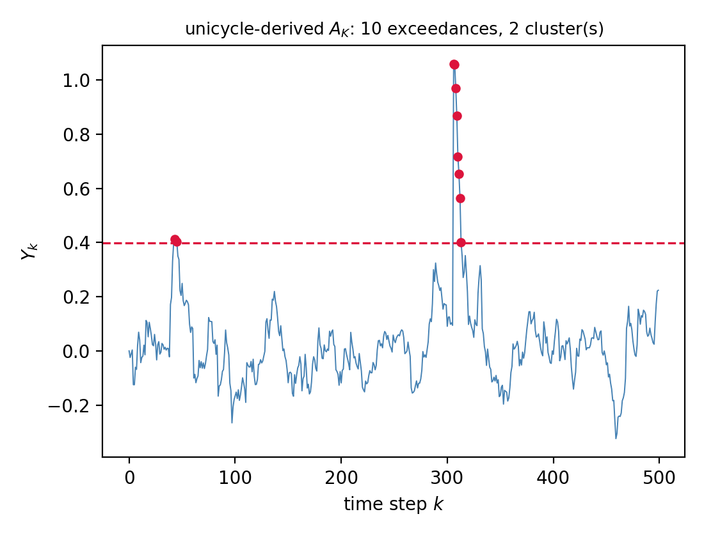
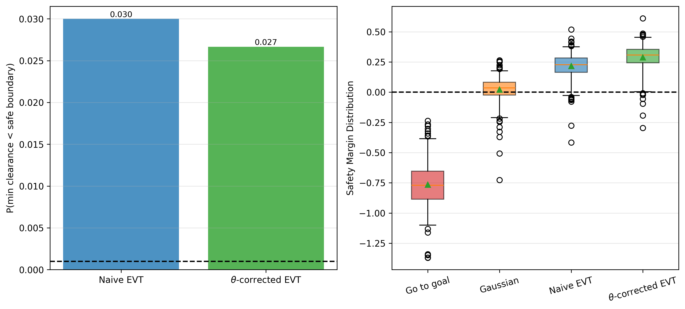

# Stochastic MPC under Heavy-Tailed Disturbances: An Extreme Value Theory Approach

Code accompanying the paper *"Stochastic MPC under Heavy-Tailed Disturbances:
An Extreme Value Theory Approach"* (X. Ye and W. Tang). This repository
reproduces all four figures in the manuscript.

## Summary

The paper develops a tube-based stochastic MPC (SMPC) formulation for linear
systems under heavy-tailed, regularly varying disturbances. Rather than
tightening the chance constraint using an assumed distribution (e.g.
Gaussian) or a moment bound, the tube error's tail is characterized directly
via Extreme Value Theory (EVT): a Generalized Pareto Distribution (GPD) is
fit to the peaks-over-threshold (POT) of Monte Carlo samples of the
closed-loop error, giving an asymptotically exact quantile estimate as the
target violation probability $\epsilon \to 0$. The paper further shows that
closed-loop dynamics induce temporal clustering of rare excursions across
the prediction horizon, characterized by Leadbetter's extremal index
$\theta \in (0,1]$, estimable in closed form from the closed-loop system
matrices. The resulting $\theta$-corrected constraint targets
$\epsilon_\star = -\ln(1-\epsilon)/(\theta N)$ instead of the raw per-step
$\epsilon$, bounding the probability of a rare-event episode over the
horizon rather than only the marginal per-step exceedance probability. The
approach is validated on a nonlinear unicycle navigating past an obstacle
under Student-$t$ disturbances.

## Install

```bash
pip install -r requirements.txt
```

`numpy`, `scipy`, `matplotlib`, and `cvxpy` (with its bundled OSQP solver)
cover everything below; the MPC solve (Figures 2 and 4) is the only part
that needs `scipy`/`cvxpy`.

## Figures

**Figure 1 — extremal index illustration.** A realization of the AR(1)
toy model showing exceedances clustering into episodes, and the
running-maximum probability compared to the i.i.d. and dependent-process
theoretical curves.



**Figure 2 — scenario and naive-tightening comparison.** Representative
trajectories and minimum-clearance histograms for the baseline / Gaussian /
naive-EVT controllers on the unicycle obstacle-avoidance scenario.



**Figure 3 — extremal index validation on the unicycle scenario.** An
illustrative trajectory with exceedance clusters marked, using the
closed-loop gain actually derived from the unicycle scenario.



**Figure 4 — effect of the θ-correction.** Empirical violation probability
for naive-EVT vs. θ-corrected-EVT against the target $\epsilon$, and
safety-margin distribution across all four controllers.



## Which script to run

All scripts live at the repo root and are run directly with `python
<script>.py` — no `cd` or subfolder needed.

| Figure | Run this |
|---|---|
| Figure 1 | `python extremal_index_illustration.py` |
| Figure 1, cross-check (console output only, no figure) | `python estimate_theta_Y.py` |
| Figures 2 and 4 (reads `comparison_data.npz`, renders both) | `python plot_figures.py` |
| Figure 3 | `python validate_theta_unicycle.py` |
| Figure 3, risk demo (`theta_corrected_tightening_demo.png`) | `python demo_theta_corrected_tightening.py` |

## `main_compare_controllers.py`

This is the script that originally *generated* `comparison_data.npz` (the
data behind Figures 2 and 4) — it's included for transparency and full
reproducibility, but you don't need to run it to get the figures above,
since the data file is already provided.

Four controllers are compared over $M=300$ independent trials:

| Controller | Tightening |
|---|---|
| `baseline` (go-to-goal) | none |
| `gaussian` | assumes Gaussian tube error |
| `evt` | POT/GPD quantile, naive per-step $\epsilon$ |
| `evt_theta` | POT/GPD quantile, $\theta$-corrected $\epsilon_\star = -\ln(1-\epsilon)/(\theta N)$ |

`evt` and `evt_theta` use the identical GPD estimator and MPC solve; the
only difference is the target probability level, using the extremal index
$\theta$ estimated for this scenario. Any difference between them is
therefore attributable to the clustering correction alone.

To rerun the full comparison from scratch (slow — this is the "overnight"
run referenced in the code):

```bash
python main_compare_controllers.py   # overwrites comparison_data.npz
python plot_figures.py
```

Prints "OVERNIGHT settings ... this will take a long time" and checkpoints
progress to `checkpoint.npz` every 10 trials. Random seeds are fixed
throughout, so a full rerun reproduces the included results up to
solver/platform floating-point differences.

`main_linearize_smpc.py` is the linearize-and-resolve (SCP) tube-SMPC
solver used inside the comparison; `main_Monte_Carlo.py` is a standalone
Monte Carlo safety-evaluation utility. `Helper_*.py` cover system setup and
disturbance sampling, the DLQR gain, dynamics/obstacle linearization,
nominal rollout, GPD/EVT quantile estimation, extremal-index estimation,
the tightened-QP solve, and shared type/dataclass definitions.

## Citation

If you use this code, please cite:

```
X. Ye and W. Tang, "Stochastic MPC under Heavy-Tailed Disturbances: An
Extreme Value Theory Approach," [venue/year].
```
